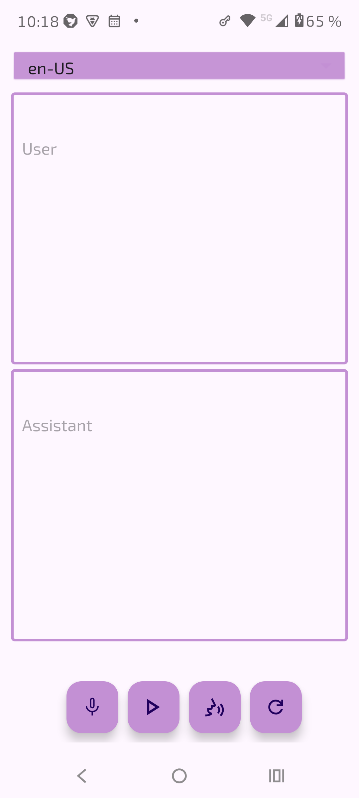

# Medical assistant based on MedGemma

- no internet required, no data ever leaves your phone
- based on Google MedGemma

Important: Do not rely on model outputs. This application is for test purposes only!
Model output not a substitute for professional medical advice. 
In case of emergency, call your local emergency services immediately!

Powered by **[MedGemma](https://deepmind.google/models/gemma/medgemma/)** and the **[SmolLM](https://github.com/shubham0204/SmolChat-Android)** inference engine (based on **[llama.cpp](https://github.com/ggml-org/llama.cpp)**).

 

---

## ✨ Features

| Feature                   | Description                                                                                  |
|---------------------------|----------------------------------------------------------------------------------------------|
| **100% offline**          | All inference runs locally via GGUF on-device model execution                                |
| **Privacy-first**         | Zero network calls, no internet permission — your text never leaves the device                      |
| **Voice input**           | Install Whisper+ from F-Droid for this feature or any other voice input that supports intent |
| **Voice output**          | Via system text-to-speech. It is recommended to use SherpaTTS from F-Droid                   |
| **System theme**          | Follows your device's light/dark setting automatically                                       |

## 🤖 Model Setup

The app requires a MedGemma GGUF model file at runtime. On first launch, you are redirected to the **Setup Activity** where you can:

### Download model

Tap **Download**, which opens Hugging Face in your browser.

### Install

Tap **Install Model**, select the `.gguf` file from your device using the system document picker, and the app copies it into its private storage.

Once the model is in place, tap **Start** to launch the translator.

---

## 🙏 Acknowledgements

- **[Google Research](https://huggingface.co/collections/google/medgemma-release)** — MedGemma models (Health AI Developer Foundation's terms of use)
- **[shubham0204](https://github.com/shubham0204/SmolChat-Android)** — SmolLM Android inference engine (Apache 2.0 license)
- **[mradermacher](https://huggingface.co/mradermacher)** — Quantized TranslateGemma GGUF model weights (Gemma license)
- **[llama.cpp](https://github.com/ggml-org/llama.cpp)** — LLM inference in C/C++ (MIT license)

---
